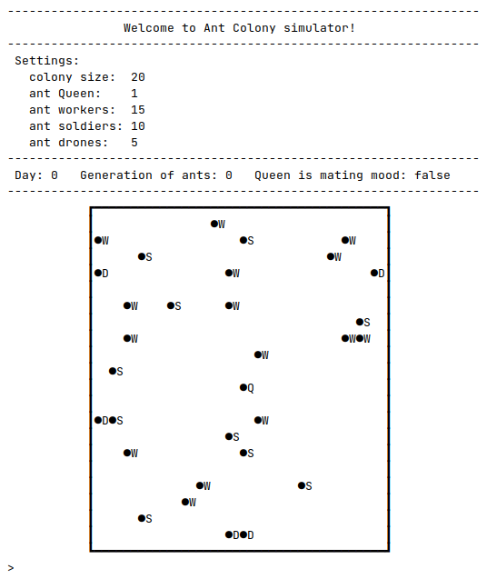

# Life of the Ants

## Description

Colony, ants and their wonderful world of miniature! Life of the Ants is an ants' simulator. We will observe the life
of ants and their queen in it.

The colony area is square (has a width), and the ants live and move within the borders of the colony.
There are four types of ants in the colony:
- **The Queen** - is always in the center of the colony and does not move. Every random number of rounds, between 50 and
  100, the queen is ready for mating mood.
- **Workers** - move in a random direction.
- **Soldiers** - move around in a circle, always turning to the left.
- **Drones** - always try to make one step towards the Queen. When they get next to the Queen, they have a chance that
  she is in the mood of mating. In this happy case, they stay next to the Queen more time, and the number of generations
  of the ants increases. After that they are kicked off to a random position at the edge of the colony. If the queen
  isn't in the mood, drones are kicked away instantly, and the whole migration process begins again.

The application was created as a task at [CodeCool](https://codecool.com/en/) school. A description of the task
as well as additional information can be found in [Wiki](https://github.com/piotrmludzik/Life-of-the-Ants/wiki) section:
- [Exercise](https://github.com/piotrmludzik/Life-of-the-Ants/wiki/Exercise)
- [Diagrams](https://github.com/piotrmludzik/Life-of-the-Ants/wiki/Diagrams)

## Screenshots

## Real-time preview

[https://replit.com/@piotrmludzik/Life-of-the-Ants](https://replit.com/@piotrmludzik/Life-of-the-Ants)

## Used technologies:

## Challenges:

- think in OOP way,
- design an application using a class diagram,
- the first OOP program designed and written from scratch.

## Contact info

Feel free to contact me in case of any issue, questions or comments.
My contact info can be found on my [GitHub page](https://github.com/piotrmludzik).

## License

The content of the exercise and the initial code in the repository are owned by [CodeCool](https://codecool.com/en/).

Copyright (c) 2020 by Piotr Mludzik. All rights reserved.  
Code in this repository is licensed under MIT license. See [LICENSE](https://github.com/piotrmludzik/Life-of-the-Ants/blob/master/LICENSE).